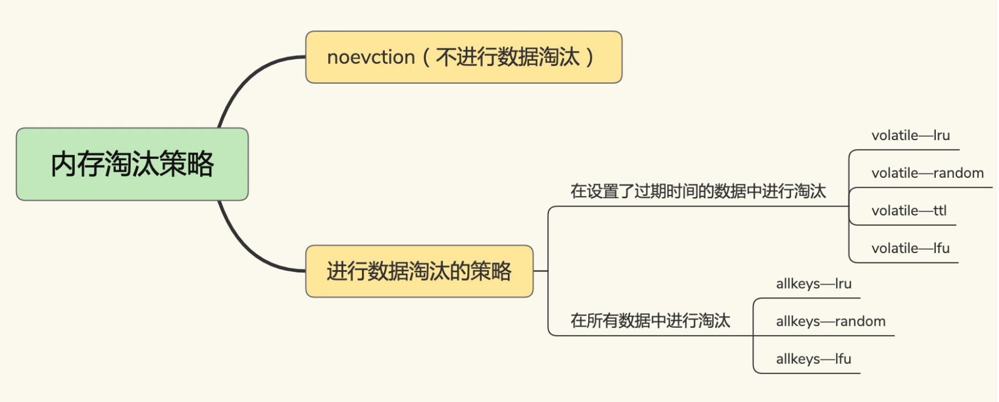
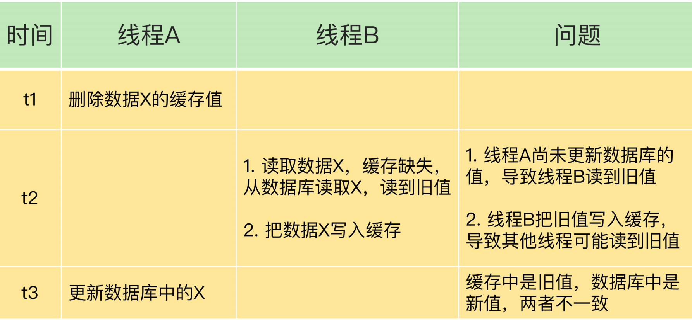

# Redis 作为缓存要知道的那些事儿

## Redis 作为缓存是如何工作的

### 缓存的特征

1. 在一个层次化的系统中，缓存一定是一个快速子系统，数据存在缓存中时，能避免每次从慢速子系统中存取数据。对应到互联网应用来说，Redis 就是快速子系统，而数据库就是慢速子系统了。
2. 缓存系统的容量大小总是小于后端慢速系统的，我们不可能把所有数据都放在缓存系统中。

### Redis 缓存处理请求的两种情况

**缓存命中：**Redis 中有相应的数据，就直接读取 Redis，性能非常快。

**缓存缺失：**Redis 中没有保存相应的数据，就从后端数据库中读取相应的数据，性能就会变慢。

### Redis 作为旁路缓存的使用操作

我们把 Redis 称为旁路缓存是因为读取缓存、读取数据库和更新缓存的操作都需要在应用程序中完成。

使用 Redis 缓存时，我们需要在应用程序中增加 3 方面的代码：

>- 当应用程序需要读取数据时，我们需要在代码中显式调用 Redis 的 GET 操作接口，进行查询；
>- 如果缓存缺失了，应用程序需要再和数据库连接，从数据库中读取数据；
>- 当缓存中的数据需要更新时，我们也需要在应用程序中显式地调用 SET 操作接口，把更新的数据写入缓存。

在使用旁路缓存时，我们需要应用程序中增加操作代码，增加了使用 Redis 缓存的额外工作量，但是，也正因为 Redis 是旁路缓存，是一个独立的系统，我们可以单独对 Redis 缓存进行扩容和性能优化。

### 缓存的类型

- 只读缓存：先读 Redis 缓存，命中则直接返回，未命中读取后端数据库，并同时将数据存入缓存；写请求直接发给后端数据库，在数据库中增删改，对于删改的数据来说，如果 Redis 已经缓存了，则将其删除。
- 读写缓存：所有的写请求也会发送到缓存，在缓存中直接对数据进行增删改操作。此时，得益于Redis 的高性能访问特性，数据的增删改操作可以在缓存中快速完成，处理结果也会快速返回给业务应用，这就可以提升业务应用的响应速度。根据业务应用对数据可靠性和缓存性能的不同要求，我们会有**同步直写和异步写回**两种策略。其中，**同步直写策略优先保证数据可靠性，而异步写回策略优先提供快速响应**。

## 缓存满了怎么办

### Redis 缓存的淘汰策略

Redis 4.0 之前一共实现了 6 种内存淘汰策略，在 4.0 之后，又增加了 2 种策略。

>noeviction：不进行数据淘汰的策略（Redis 的默认设置）
>
>在设置了过期时间的数据中进行淘汰，包括 volatile-random、volatile-ttl、volatile-lru、volatile-lfu（Redis 4.0 后新增）四种。
>
>在所有数据范围内进行淘汰，包括 allkeys-lru、allkeys-random、allkeys-lfu（Redis4.0 后新增）三种。

设置过期时间：

- volatile-ttl：会针对设置了过期时间的键值对，根据过期时间的先后进行删除，越早过期的越先被删除
- volatile-random：针对设置了过期时间的键值对，随机选择删除
- volatile-lru：针对设置了过期时间的键值对，根据 LRU（最近最少使用）算法进行淘汰
- volatile-lfu：针对设置了过期时间的键值对，根据 LFR（最不经常使用）算法进行淘汰

未设置过期时间：

- allkeys-random：从所有键值对中随机选择并删除
- allkeys-lru：从所有键值对中根据 LRU（最近最少使用）算法进行淘汰
- allkeys-lfu：从所有的键值对中根据 LFR（最不经常使用）算法进行淘汰

### 如何处理被淘汰的数据？

**一般情况下**，一旦淘汰的数据选定后，如果这个数据是干净数据，那么直接删除；如果是脏数据则需要写回数据库。而**对于 Redis 来说**，它决定了被淘汰的数据后，会把它们删除。即使淘汰的数据是脏数据，Redis 也不会把它们写回数据库。所以，我们在使用 Redis 缓存时，如果数据被修改了，需要在数据修改时就将它写回数据库。否则，这个脏数据被淘汰时，会被 Redis 删除，而数据库里也没有最新的数据了

## 如何解决缓存和数据库数据不一致问题？

### 缓存和数据库的数据不一致是如何发生的？

### 如何解决数据库不一致问题？

#### 先删缓存后更新数据库

该方案也会出问题，此时来了两个请求，请求 A（更新操作） 和请求 B（查询操作）

1. 请求A进行写操作，删除缓存
2. 请求B查询发现缓存不存在
3. 请求B去数据库查询得到旧值
4. 请求B将旧值写入缓存
5. 请求A将新值写入数据库

上述情况就会导致不一致的情形出现。而且，如果不采用给缓存设置过期时间策略，该数据永远都是脏数据。

**答案一：延时双删**

**在线程 A 更新完数据库以后，可以让它 sleep 一段时间，再进行一次缓存删除。**

> 这么做，可以将1秒内所造成的缓存脏数据，再次删除。确保读请求结束，写请求可以删除读请求造成的缓存脏数据。自行评估自己的项目的读数据业务逻辑的耗时，写数据的休眠时间则在读数据业务逻辑的耗时基础上，加几百ms即可。

**答案二：更新与读取操作进行异步串行化**

**异步串行化**

在系统内部维护n个内存队列，更新数据的时候，根据数据的唯一标识，将该操作路由之后，发送到其中一个jvm内部的内存队列中（对同一数据的请求发送到同一个队列）。读取数据的时候，如果发现数据不在缓存中，并且此时队列里有更新库存的操作，那么将重新读取数据+更新缓存的操作，根据唯一标识路由之后，也将发送到同一个jvm内部的内存队列中。然后每个队列对应一个工作线程，每个工作线程串行地拿到对应的操作，然后一条一条的执行。

这样的话，一个数据变更的操作，先执行删除缓存，然后再去更新数据库，但是还没完成更新的时候，如果此时一个读请求过来，读到了空的缓存，那么可以先将缓存更新的请求发送到队列中，此时会在队列中积压，排在刚才更新库的操作之后，然后同步等待缓存更新完成，再读库。

**读操作去重**

多个读库更新缓存的请求串在同一个队列中是没意义的，因此可以做过滤，如果发现队列中已经有了该数据的更新缓存的请求了，那么就不用再放进去了，直接等待前面的更新操作请求完成即可，待那个队列对应的工作线程完成了上一个操作（数据库的修改）之后，才会去执行下一个操作（读库更新缓存），此时会从数据库中读取最新的值，然后写入缓存中。

如果请求还在等待时间范围内，不断轮询发现可以取到值了，那么就直接返回；如果请求等待的时间超过一定时长，那么这一次直接从数据库中读取当前的旧值。（返回旧值不是又导致缓存和数据库不一致了么？那至少可以减少这个情况发生，因为等待超时也不是每次都是，几率很小吧。这里我想的是，如果超时了就直接读旧值，这时候仅仅是读库后返回而不放缓存）

#### 先更新数据库在删除缓存

这一种情况也会出现问题，比如更新数据库成功了，但是在删除缓存的阶段出错了没有删除成功，那么此时再读取缓存的时候每次都是错误的数据了。

此时解决方案就是利用消息队列进行删除的补偿。具体的业务逻辑用语言描述如下：

1. 请求 A 先对数据库进行更新操作
2. 在对 Redis 进行删除操作的时候发现报错，删除失败
3. 此时将Redis 的 key 作为消息体发送到消息队列中
4. 系统接收到消息队列发送的消息后再次对 Redis 进行删除操作

但是这个方案会有一个缺点就是会对业务代码造成大量的侵入，深深的耦合在一起，所以这时会有一个优化的方案，我们知道对 Mysql 数据库更新操作后再 binlog 日志中我们都能够找到相应的操作，那么我们可以订阅 Mysql 数据库的 binlog 日志对缓存进行操作。

#### 关于解决数据库不一致问题的总结

删除缓存值或更新数据库失败而导致数据不一致，你可以使用消息队列机制确保删除或更新操作成功。

在删除缓存值、更新数据库的这两步操作中，有其他线程的并发读操作，导致其他线程读取到旧值，应对方案是延迟双删或者更新与读取操作进行异步串行化。

## 如何解决缓存雪崩、击穿、穿透难题？

###  缓存雪崩

缓存雪崩是指**大量的应用请求无法在 Redis 缓存中处理，造成大量请求发送到数据库，导致数据库压力激增**。

造成缓存雪崩一般又两个原因导致：

1. 缓存中有大量的 key 同时过期，导致大量请求无法处理

2. Redis 缓存实例发生故障宕机无法处理请求

解决方案：

1、事前：

* **均匀过期**：设置不同的过期时间，让缓存失效的时间尽量均匀，避免相同的过期时间导致缓存雪崩，造成大量数据库的访问。如把每个Key的失效时间都加个随机值，`setRedis（Key，value，time + Math.random() * 10000）；`，保证数据不会在同一时间大面积失效。

* **分级缓存**：第一级缓存失效的基础上，访问二级缓存，每一级缓存的失效时间都不同。

* **热点数据缓存永远不过期**。永不过期实际包含两层意思：
  * 物理不过期，针对热点key不设置过期时间
  * 逻辑过期，把过期时间存在key对应的value里，如果发现要过期了，通过一个后台的异步线程进行缓存的构建

* **保证Redis缓存的高可用**，防止Redis宕机导致缓存雪崩的问题。可以使用 主从+ 哨兵，Redis集群来避免 Redis 全盘崩溃的情况。

2、事中：

* **互斥锁**：在缓存失效后，通过互斥锁或者队列来控制读数据写缓存的线程数量，比如某个key只允许一个线程查询数据和写缓存，其他线程等待。这种方式会阻塞其他的线程，此时系统的吞吐量会下降

* **使用熔断机制，限流降级**。当流量达到一定的阈值，直接返回“系统拥挤”之类的提示，防止过多的请求打在数据库上将数据库击垮，至少能保证一部分用户是可以正常使用，其他用户多刷新几次也能得到结果。

3、事后：

**开启Redis持久化机制，尽快恢复缓存数据**，一旦重启，就能从磁盘上自动加载数据恢复内存中的数据。

### 缓存击穿

缓存击穿跟缓存雪崩有点类似，缓存雪崩是大规模的key失效，而缓存击穿是某个热点的key失效，大并发集中对其进行请求，就会造成大量请求读缓存没读到数据，从而导致高并发访问数据库，引起数据库压力剧增。这种现象就叫做缓存击穿。

从两个方面解决，第一是否可以考虑热点key不设置过期时间，第二是否可以考虑降低打在数据库上的请求数量。

解决方案：

* **在缓存失效后，通过互斥锁或者队列来控制读数据写缓存的线程数量**，比如某个key只允许一个线程查询数据和写缓存，其他线程等待。这种方式会阻塞其他的线程，此时系统的吞吐量会下降

* **热点数据缓存永远不过期**。永不过期实际包含两层意思：
  * 物理不过期，针对热点key不设置过期时间
  * 逻辑过期，把过期时间存在key对应的value里，如果发现要过期了，通过一个后台的异步线程进行缓存的构建

### 缓存穿透

缓存穿透是指用户请求的数据在缓存中不存在即没有命中，同时在数据库中也不存在，导致用户每次请求该数据都要去数据库中查询一遍。如果有恶意攻击者不断请求系统中不存在的数据，会导致短时间大量请求落在数据库上，造成数据库压力过大，甚至导致数据库承受不住而宕机崩溃。

解决方法：

* 将无效的key存放进Redis中：

当出现Redis查不到数据，数据库也查不到数据的情况，我们就把这个key保存到Redis中，设置value="null"，并设置其过期时间极短，后面再出现查询这个key的请求的时候，直接返回null，就不需要再查询数据库了。但这种处理方式是有问题的，假如传进来的这个不存在的Key值每次都是随机的，那存进Redis也没有意义。

* 使用布隆过滤器：

如果布隆过滤器判定某个 key 不存在布隆过滤器中，那么就一定不存在，如果判定某个 key 存在，那么很大可能是存在(存在一定的误判率)。于是我们**可以在缓存之前再加一个布隆过滤器，将数据库中的所有key都存储在布隆过滤器中，在查询Redis前先去布隆过滤器查询 key 是否存在**，如果不存在就直接返回，不让其访问数据库，从而避免了对底层存储系统的查询压力。

> 如何选择：针对一些恶意攻击，攻击带过来的大量key是随机，那么我们采用第一种方案就会缓存大量不存在key的数据。那么这种方案就不合适了，我们可以先对使用布隆过滤器方案进行过滤掉这些key。所以，针对这种key异常多、请求重复率比较低的数据，优先使用第二种方案直接过滤掉。而对于空数据的key有限的，重复率比较高的，则可优先采用第一种方式进行缓存。